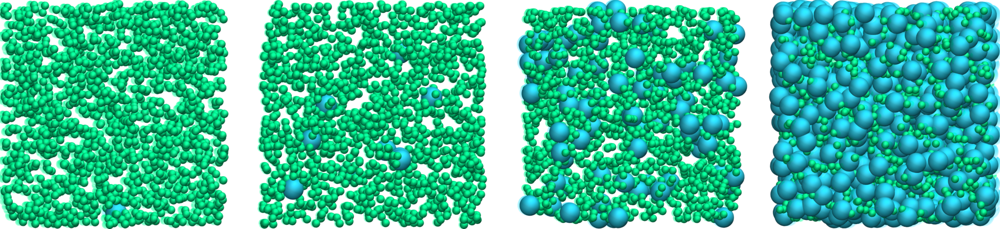

Bash tutorial
*************

Bash scripts can help launch multiple simulations and interact with LAMMPS input
scripts. This can be useful for instance to efficiently explore a parameter space.

In this tutorial, a simple LAMMPS input script is launched multiple times using
a Bash script. At each iteration, the number of particles is increased.

Figure: Binary Lennard-Jones fluid with 1500 particles of type 1 (small spheres)
and an increasing number of particles of type 2 (large spheres),
from 1 (left) to 729 (right).

Files preparation
-----------------

To follow this tutorial, |input_file| this simple LAMMPS input file
from the Lennard-Jones tutorial of the LAMMPS tutorials `webpage <lammps_tutorials_>`_.

.. |input_file| raw:: html

   <a href="scripts/input.lmp" target="_blank">download</a>

.. _lammps_tutorials: https://lammpstutorials.github.io

The main change that were made in this input, compared to the original LAMMPS tutorial,
are the use of a variable *nb2* to control the number of particles of type 2:

..  code-block:: lammps

    create_atoms 1 random 1500 921342 simulation_box overlap 1 maxtry 500
    create_atoms 2 random ${nb2} 225469 simulation_box overlap 1 maxtry 500

Normally, we would specify the value of *nb2* within *input.lmp* using
something like *variable nb2 equal 10*, but here instead the value of 
*nb2* will be specified externally using *Bash*.

Another change from the tutorial is that the *overlap*
and *maxtry* keywords were added to ensure that the desired number
of atoms will always be created.

Pass a variable to a LAMMPS input
---------------------------------

The value of nb2 can be specified externally by using *-var* keyword. In the
terminal, call LAMMPS using: 

..  code-block:: bash

    lmp -in input.lmp -var nb2 81

Here, *lmp* refers to the compiled LAMMPS version and a value of 81 is
given to the variable *nb2*. Looking at the log file generated during the
simulation, it should be clear that 81 particles of type 2 were created
in addition to the 1500 particles of type 1:

..  code-block:: bash

    Created 1500 atoms
    (...)
    Created 81 atoms

Make a loop
-----------

Let us use Bash to launch LAMMPS multiple times with different values of the
variable *nb2*.

Next to the downloaded *input.lmp*, create a new empty file called
*launch_LAMMPS.sh*, and copy the following lines into it. 

..  code-block:: bash

    #!/bin/bash
    set -e

    for nb2 in 1 9 81 729
    do
        echo 'nb2 = '${nb2}
    done

The first line *#!/bin/bash* indicates that this is a Bash script,
and *set -e* tells Bash to exit immediately in the case of an error.

Then, within the for loop, the variable $nb2$ takes on the values 1, 9, 81,
and 729 successively, and the *echo* command prints its value at each step.
This Bash script can be executed by typing in a terminal:

..  code-block:: bash

    bash launch_LAMMPS.sh

This should return:

..  code-block:: bash

    nb2 = 1
    nb2 = 9
    nb2 = 81
    nb2 = 729

Let us complete the script by calling LAMMPS at each step of the loop:

..  code-block:: bash

    #!/bin/bash
    set -e

    for nb2 in 1 9 81 729
    do
        echo 'nb2 = '${nb2}
        lmp -in input.lmp -var nb2 ${nb2}
        folder=nb${nb2}
        mkdir ${folder}
        cp dump.lammpstrj ${folder}
    done

Replace the *lmp* variable with the proper path to your LAMMPS executable. 

The command starting with *lmp* calls the LAMMPS input *input.lmp*,
while also passing the value of *nb2* to the LAMMPS variable named *nb2*.

Once the LAMMPS simulation is over, a folder named *nbi*, with i = 1, 9, 81,
or 729 is created by the *mkdir* command, and the resulting *lammpstrj* file
is copied into it by the *cp* command.

An alternative way to launch *launch_LAMMPS.sh* is to make it executable
first:

..  code-block:: bash

    chmod +x launch_LAMMPS.sh
    ./launch_LAMMPS.sh

Pass a random number
--------------------

Some LAMMPS commands use seeds, such as the *create_atoms* command.
To generate statistically independent simulations, it is sometimes
useful to launch the same input several times using a different seed.

Within *input.lmp*, add a new variable called *rdm* to the second 
*create_atoms* command:

..  code-block:: lammps

    create_atoms 2 random ${nb2} ${rdm2} simulation_box overlap 1 maxtry 500

Then, within the bash script *launch_LAMMPS.sh*, modify the command line as
follows:

..  code-block:: bash

    lmp -in input.lmp -var nb2 ${nb2} -var rdm2 $RANDOM

The *-var rdm2 $RANDOM* was added to pass a random number to
the LAMMPS input file. This way, every time the same input file is used,
a different configuration will be created by LAMMPS. 